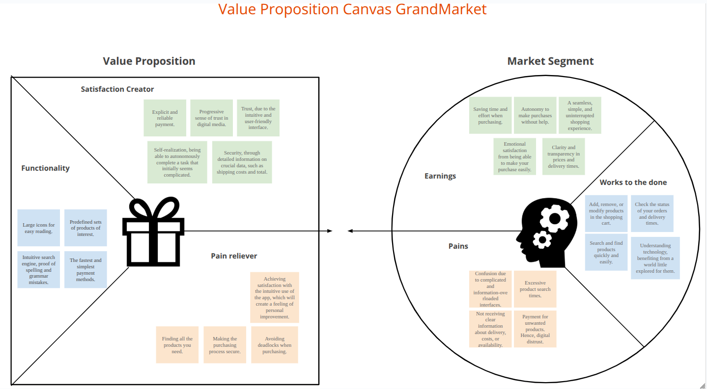
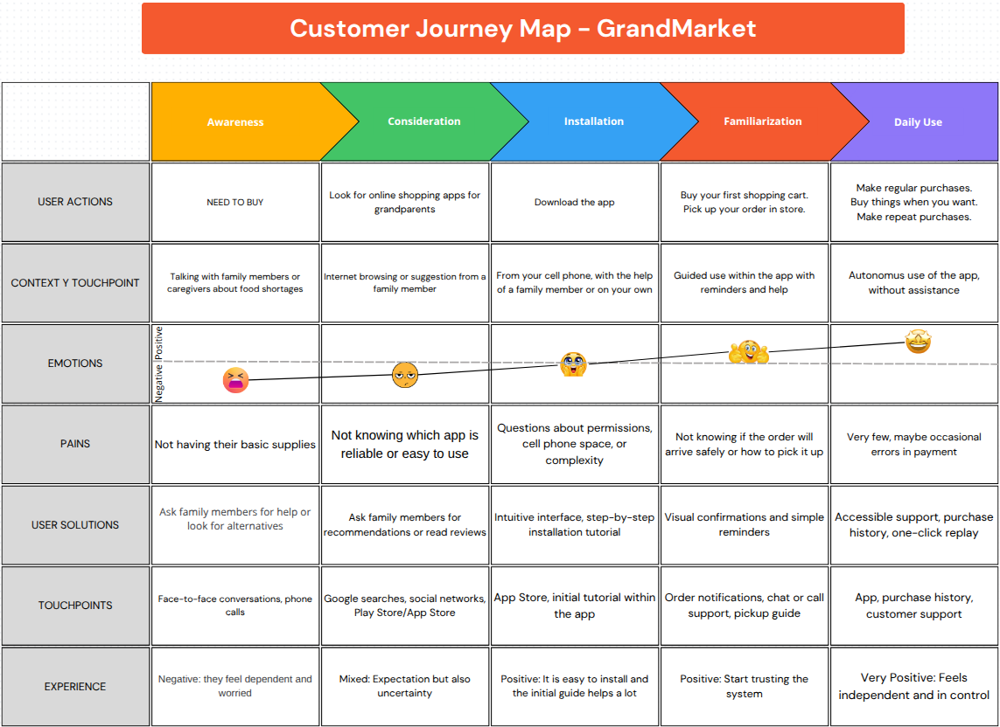
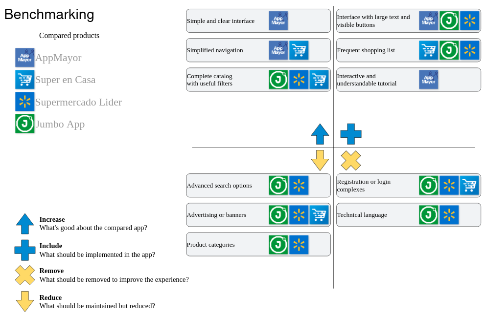
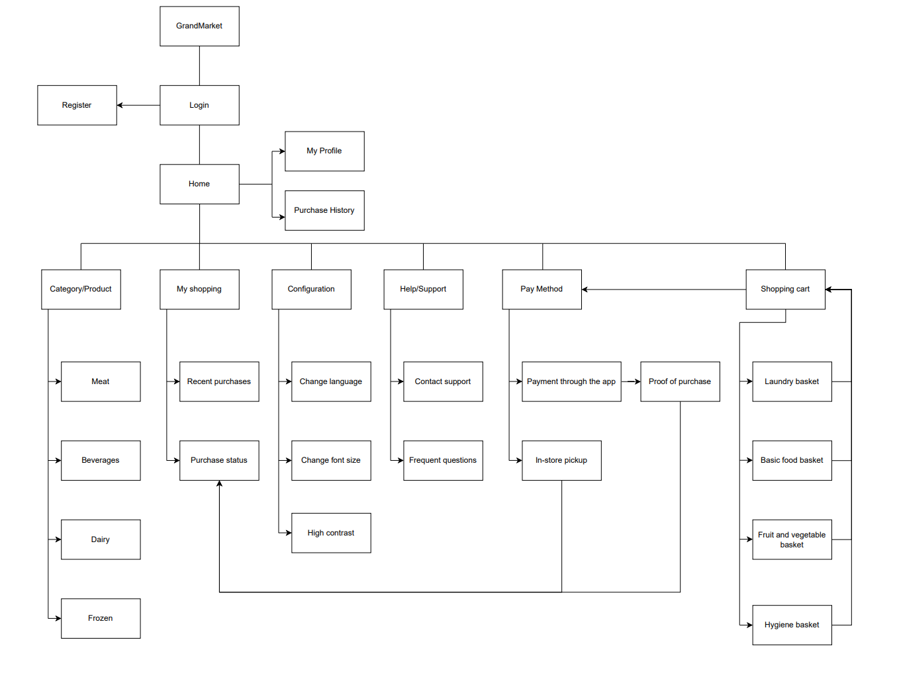

# GrandMarket-UXD
User experience design process for GrandMarket – A simple and accessible way for older adults to shop for groceries from home or in-store.
## Index
- [Introduction](#Introduction)
- [Team](#Team)
- [Description](#Description)
- [Strategy](#Strategy)
- [Scope](#Scope)
- [Structure](#Structure)
- [Skeleton](#Skeleton)
- [Surface](#Surface)

---
## Introduction
GrandMarket is a mobile application that seeks to improve the shopping experience of seniors in supermarkets. Its focus is on facilitating navigation, content 
comprehension and the payment process, whether online or in person. Emphasis is placed on simplicity, accessibility and trust throughout the experience.

---
## Team
- [Jesús Acevedo](https://github.com/jesus-acev) - Project Manager
- [José Huircaleo]() - Analyst
- [Esteban Saez]() - Designer
- [Marcelo Henríquez](https://github.com/mh0316) - Exhibitor
- [Camilo Ñanco](https://github.com/camilo09m) - Support

---
## Description

The purpose of this project is to offer a simple, inclusive and efficient digital shopping experience for adults, especially for those who have little familiarity 
with technology. The problem detected is the difficulty that many supermarket applications present for this age group, as they are complex, visually loaded or require 
previous knowledge of technology. GrandMarket seeks to facilitate the shopping process through guided flows, predefined baskets and simple payment options, 
either in the app or in-store. This document covers the main elements of UX design: strategy, scope, structure, skeleton and surface.

---
## Strategy

As a starting point, a Value Proposition Canvas was used to gain an in-depth understanding of the target user and the elements required to offer them a meaningful 
experience tailored to their needs.

This analysis revealed a series of important pains, such as the fear of making a mistake during the purchase, the confusion generated by overloaded and unintuitive interfaces, 
the lack of clear information about costs and delivery times, as well as the distrust towards digital payments. To mitigate these difficulties, key functionalities were 
defined to alleviate these problems: large and legible icons, predefined product sets that facilitate the choice, a search engine tolerant to misspellings and fast and 
easy payment methods.
In addition, the proposal seeks to generate a feeling of progressive trust in the user, thanks to a user-friendly and transparent interface that clearly details crucial data 
such as total cost and shipping times. This approach fosters user self-fulfillment by allowing them to autonomously complete a task that may initially seem complex, thus 
achieving a sense of self-improvement.
Las ganancias esperadas incluyen un ahorro tangible de tiempo y esfuerzo durante la compra, autonomía para realizar pedidos sin depender de ayuda externa, y una experiencia 
fluida y sencilla que evita interrupciones o bloqueos en el proceso. La claridad en los precios y la transparencia en los tiempos de entrega contribuyen a una satisfacción 
emocional que fortalece la confianza en la aplicación.
Finalmente, los trabajos que el usuario desea realizar están claramente identificados: agregar, eliminar o modificar productos en el carrito, consultar el estado y 
tiempos de entrega de sus pedidos, y buscar productos de forma rápida y sencilla. Todo ello orientado a que pueda comprender y beneficiarse de un mundo digital que para 
ellos es relativamente nuevo, sin sentirse abrumados ni inseguros.

---

## Scope

Based on the strategy, a user profile was defined and the behavior during the use of the application was projected.

Using the user's characteristics, we developed a customer journey map that traces their experience from discovering the app to regularly using it. The map considers 
their emotions, frustrations, and real needs. The map has five stages: discovery, evaluation, installation, familiarization, and daily use. It is organized around the 
user's actions, context, emotions, pain points, perceived solutions, and touchpoints in each phase.

Along with designing the user journey, we carried out a comparative analysis of similar applications, such as AppMayor, Super en Casa, Supermercado Líder, and Jumbo App, 
considering their usefulness, accessibility, and suitability for older adults.
This benchmarking exercise enabled us to identify good practices and mistakes to avoid. Useful practices included the use of large icons, streamlined payment processes 
and the option to save frequent orders. In contrast, we identified elements that frustrate the target group, such as cluttered interfaces, intrusive advertising, excessive 
notifications, and a lack of clear information on costs or delivery times.
Based on these findings, GrandMarket takes an approach focused on simplicity, visual accessibility, and security in every interaction. The app prioritizes the essentials: 
clear shopping, personalized options according to consumption habits, and visible yet non-invasive assistance.

---
## Structure

The GrandMarket application is structured around a primary screen, designated "Home," from which users can access the various functionalities of the application. From this screen, 
one can navigate to various modules, including "Shopping Cart," "My Purchases," "Settings," "Help and Support," "My Profile," and "Purchase History." Each of these modules has 
been meticulously engineered to execute particular tasks pertinent to the senior shopping experience, while ensuring a straightforward and accessible navigation paradigm. 
For instance, the "Shopping Cart" module consolidates access to various types of pre-designed baskets, including the basic basket, fruit and vegetable baskets, hygiene baskets, 
and frozen food baskets. Consequently, the "Category/Product" module furnishes thematic access to products such as meat, beverages, and dairy products, emulating the logic of a 
physical supermarket but with an optimized visual interface. Concurrently, the configuration modules enable accessibility adjustments such as modifying language, font size, or 
visual contrast. The help section furnishes contact support and frequently asked questions. The underlying objective of this structure is to minimize cognitive load, eliminate 
superfluous steps, and ensure visual and functional coherence. This approach enables users to navigate seamlessly and intuitively, obviating the need for complex exploration processes.

---

## Skeleton

---
## Surface

---
